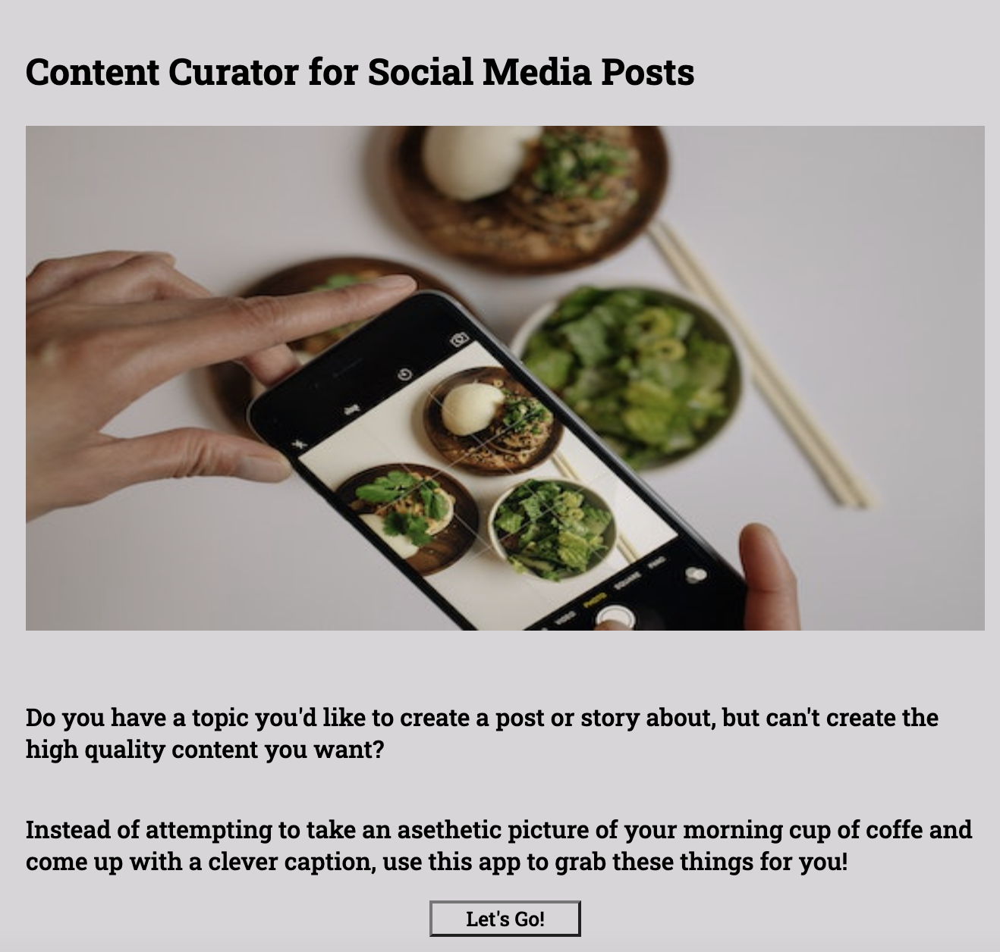
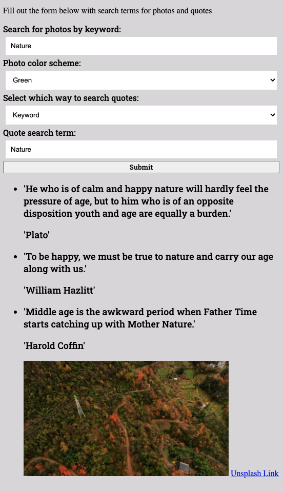

Social Media Content Curator

https://acheckler.github.io/IG_Content_Inspo_App/

An application for social media professionals or the average user, for when the inspiration is there but the content isn't.

This app uses the Unsplash API and the QuoteGarden API to collect images and phrases to be used in social media posts or stories. Once the user inputs their keywords into the search form, photos are returned with a link to their unsplash page, and all quotes are credited with their original author, so the user can properly utlize the content and give credit if needed.

Welcome Page:

Search Page and Example Results:

Technologies Used:
HTML, CSS, Javascript, Jquery, Unsplash API and QuoteGarden API.
